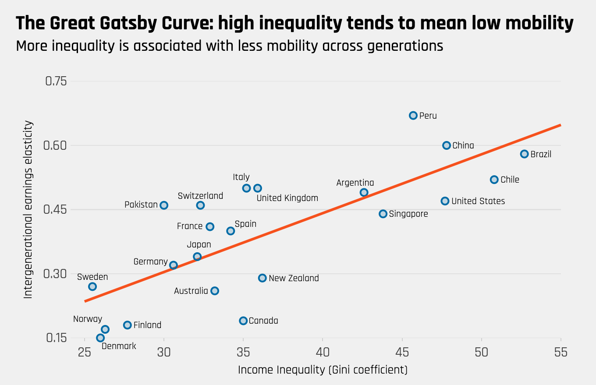

# 相关理论及文献综述

## 相关理论

### 人力资本理论

“人力资本”的概念最早是由美国经济学家舒尔茨在20世纪60年代提出的。这引起很多学者的广泛关注,也带动了这个概念不断地发展成熟，并形成一个相对独立于一般经济学的系统性的理论体系。这一理论是现代西方经济学的重要组成部分, 也为教育经济学的产生和发展葛定了重要的理论基础。


#### 舒尔茨人力资本理论

在第二次世界大战之后,德国和日本的经济遭受到了严重的打击，国家遭受了重创。很
多学者认为，德国和日本要想恢复往日的辉煌最少也要半个世纪, 但是德国和日本走出经;
萧条仅仅用了 15 年。甚至到了 20 世纪 60 年代，德国和日本的经济实力跃居为世界第二和
第三的水平，仅次于美国。这种现象震惊了世界，也让传统的经济学陷入困境，因为无法解
释这种经济现象, 于是很多经济学家以及学者对这种经济现象进行更加深入的研究。被称为
“人为资本之父”的舒尔茨便在此时提出“人力资本”的概念。舒尔茨认为，一个国家生产
力水平的提高,不仅仅取决于物质资本存量,劳动力数量和自然资源的富裕程度等生产要素，
人力资本也是其中不可忽视的生产要素。大范围的世界战争一方面使德国和日本的物质资本
和自然资源受到严重的摧残, 另一方面却也保留下大量的人力资本, 尤其是高素质的估沪资
本。这使得德国和日本经济的恢复及增长似乎成为了必然趋势。这种“人力资本”的观点能
够很合理地解释德国和日本的经济在第二次世界大战之后快速恢复和发展的现象。

如同物质资本一样， 人力资本也会产生效益, 而且当物质资本和人力资本的投资收益率
相等时，总的效益达到最大化，此时是最优的投资比例。近代以来，一个国家或地区的经济
增长不能过度依赖自然资源的消耗和盲目地追求廉价劳动力, 更要注重人力资本的质量。通
过加大对教育、医疗卫生和科学技术等方面的投入,来提高人力资本水平，提高该国劳动力
的质量，增强生产率水平，从而促使经济快速的增长。


教育对于提高人力资本水平起到非常重要的作用。通过教育，劳动者可以提高自身的知
识和技能水平，从而找到更好的就业机会，提高自身的工资收入水平。舒尔茨认为，受教育
水平的不同很大程度上导致人与人之间的薪资报钴及其增长速度的不同。受到更好教育的劳
动者,懂得更多的知识和实际应用技能，能够有效地提高劳动生产率，从而收入水平得到相
应的提高。因此,一个国家的整体教育水平的提高有利于缩小贫富差距，尤其是基础教育水
平的提高, 包括基础教育的年限延长及基础教育的质量提高等。这有利于缓解社会矛盾，促
进整体社会的进步与发展。


舒尔茨还认为，在对经济增长贡献方面，人力资本比物质资本的作用更加显著。在人力
资本方面,教育又起到最为重要的作用。他的理论得到了很多国家及学者的肯定，为很多国
家在教育方面的政策制定等提供了一定的理论依据。

#### 贝克尔人力资本理论

贝克尔主要在具体的微观视角来研究和分析人力资本, 这在一定程度上补充了舒尔茨的
理论。贝克尔认为，人力资本不仅局限于表面的知识及技能水平等，还包括劳动者内在的健
康和时间等。健康状况的好快很大程度上影响了劳动者的可持续劳动时间, 因此必须放到人
力资本的内涵中。他还认为，在人力资本的形成过程中，教育和培训起到了至关重要的影响。

贝克尔的突出贡献之一是用成本一效用法来分析了单位家庭的生育行为的经济决策。他
把生孩子的成本分为直接成本和间接成本, 还提出家庭时间价值和时间配置等概念。在传统
的经济学理论中, 教育、医疗保健等方面的费用支出属于消费行为。但是贝到尔认为这些都
是投资行为, 因为这些费用和支出未来都可以通过人力资本水平的提高来产生收益。贝克尔
还为测量人力资本的价值提供了一定的方法, 即成本法, 由人力资本花费的各项开支费用来
测算, 目前很多国内外的学者还在使用这种方法来估算人力资本的存量。贝克尔人力资本理
论为之后的人力资本发展起到重要的推动作用。

### 教育人力资本

教育人力资本投资是人力资本投资中核心的一部分, 受教育水平很大程度上影响着人力
资本水平，因此，教育人力资本占据非常重要的地位。目前国内很多测算人力资本存量时，
用的就是受教育程度。舒尔茨认为，人力资本投资水平是影响经祷增长的重要因素之一，而
教育人力资本投资又是人力资本投资的主要方面。贝克尔提出,衡量人力资本的投资水平的
重要指标是全国在教育方面的投资与国民总收入的比值, 该比值较大有利于促进经济的快速
增长。从宏观上来讲，教育人力资本投资是一种国家或地区层面的投资,是指投入到教育事
业的各种要素的总和, 包括公共财政预算安排的教育经费,政府性基金预算安排的教育经费、
企业办学中的企业拨款、校办产业和社会服务收入用于教育的经费等。从微观上来讲，教育
人力资本投资是一种家庭层面的投资，是一种持久性的长期投资。从小孩出生后就要开始，
一般要持续十几年甚至二十多年，而且它所带来的回报并不是立即可以产生的, 是有一段滞
后时间的，通过长时间的知识和技能的培训,使得被投资者，也就是子女能够参与到社会工
作中，给家庭和社会带来较大的回报。教育人力资本投资所带来的效应不仅在于知识效应，
还有非知识效应。且前人们比较关注的是知识效应，也就是教育所带来的直接影响，但是同
时也不能忽略非知识效应，甚至有时候非知识效应反而更重要。比如在接受长时间的教育形
成的价值观和道德观, 在学习知识的过程中, 形成较高的判断能力、认知能力和思维能力等，
包括对对个人、家庭和社会的责任感，这些都是教育人力资本可以产生的非知识效应。本文
中研究的教育人力资本主要是从微观家庭的视角分析, 研究教育人为资本的代际传递方面的
问题。


### 盖茨比曲线

盖茨比曲线, 来源于著名小说《了不起的盖茨比)。这部小说描述了二十世纪二十年代，美国社会贫富差距和阶层固化问题都非常严重,上层社会生活奢靡,基层民众则缺乏上升渠道,“美国梦”对于底层群众来说只是个梦。盖茨比曲线是一条向右上方倾斜的曲线，表明收入差距较大的国家具有较低的代际流动性。它也反映出这样的状况: 一个国家或地区的不平等性越高,子女的社会经济地位就越大程度上由其父母的社会经济地位决定, 子女处于父辈的经济阶层的可能性就越高。图\@ref(fig:fig-Gatsby-Curve)中的横轴是基尼系数,表示一个国家的社会不公平程度，基尼系数越大，表明社会不公平程度越高，纵轴是“代际收入弹性”，表示父辈的收入水平对子女收入水平的影响，该数值越大，说明收入的代际流动性越低，子女处于父辈的经济阶层的概率就越高。从盖茨比曲线可以看出，国家越处于右上方，说明该国的社会阶层固化越严重，国家越处于左下角，说明该国的社会越公平。从图 \@ref(fig:fig-Gatsby-Curve) 中还可以看出，盖茨比曲线的左下角分布的主要是社会福利较好的北欧国家，比如丹麦和芬兰等。 中国的位置偏右上方，说明中国的社会阶层固化现象已经非常严重。一般认为，在现实生活中打破阶层固化现象最有效的是借助教育的手段,人们期望教育能够成为削平社会阶层的利器。但是要想实现这个愿景的前提条件是教育公平和教育机会均等,而教育代际传递的强弱就能一定程度地体现出教育的公平性,因此对教育代际传递的研究能一定程度上反映出是否存在社会阶层固化现象，这种现象有多严重。


```{r fig-Gatsby-Curve, echo=FALSE, out.width = '100%', fig.cap= "盖茨比曲线"}

```


### 教育的代际传递

“代际传递”的概念最早是由研究社会学的学者提出来的,他们主要研究社会阶层继承
方面的问题。 一些学者通过对贫困阶层的研究发现, 一个地区或者家庭的贫困表现出相对稳
定性的特点,这种贫困会通过代际传递，表现为一个家庭或地区的长时间的贫困，也就出现
了“贫困代际传递”的概念。主要传递方式表现为， 父母一辈的贫困会通过各种因素传递给
其子女，使得子女也很难走出贫困，造成了贫困在代际之间的传递。相反，富人的财富也会
形成一种代际传递。富人利于自己的财富和资源为子女提供良好的教育环境及资源,又通过
自己的关系人脉为子女找到较好的工作，使得自己的后代也会成为社会地位比较高的人群。
这种“代际传递效应”反映出社会存在一定程度的“阶层固化”现象。相比贫困本身而言，
贫困代际传递对社会的稳定有着更大的威胁, 会让贫困人口没有了脱贫的物质基础和向上层
流动的精神动力，从而加剧了社会的不公平现象，可能导致犯罪率上升，影响社会的稳定。
通过学者的研究发现，提高教育水平是解决贫困代际传递最有效的手段，先从精神上脱贫，
从而有更多的动力来实现在物质方面的脱贫 。

 
 
在教育代际传递方面的研究最具代表的是“最大维持不平等理论”(简称 MMI) 和“有
效维持不平等理论”(简称 EMI)。“MMI”理论是由拉夫特里和豪特(1993)[@Raftery1993] 提出来的，这个理论主要说明教育规模的扩张与阶层之间受教育机会不平等之间的关系。
他们通过对爱尔兰藤教育资源进行研究,发现提高国家总体教育资源的规模,并不会让社会各个阶层的受教育机会展现出均等化的趋势。他们认为，一个国家和地区的教育资源很大程度是被上层阶级和优
势阶级占有，当教育资源的供给增加时，上层阶级会是最大的受益者，只有当他们的教育需
求已经足够饱和之后, 教育资源才会向中层和下层阶级传递,否则教育机会的不平等现象会
一直被最大化的方式来维持。

但是这种理论受到一些学者的质疑, 因为在某些国家的实证分析中, 教育规模的扩张确
实缓解了受教育机会不平等的现象。卢卡斯 (2001) [@Lucas2001] 认为“MMI”理论的视角只在于教育数
量，但是忽视了教育质量的视角，并在此基础上上，提出了“EMI”理论。该理论认为，受教
育不平的现象会被“有效”地维持。当一个国家或地区的总体教育资源增加时，优势阶层的
子女的整体受教育机会增加，这一点和“MMI”理论一致，但是当优势阶层的受教育数量达
到饱和时，优势阶层会更加追求子女的受教育质量，会追求更高质量的学校，追求重点中学
和优秀的大学，从而表现出受教育质量的不平等。从我们的周围也可以看出，尤其是随着经
济的发展， 教育实力的增强，目前很多父母不止追求子女上学,更追求上好学校，不止要上
大学, 更要上重点大学和名牌大学.教育具有阶段的累积性, 要想上好大学就要上重点中学，
要想上重点中学就要上重点小学，想上重点小学就要上质量较高的幼儿园. 为了子女在起跑
线上就占据优势, 学历较高的父母从小就会让子女接受较高质量的教育,并为此不异花帆重
金。天价“学区房”就非常能体现出这一点。


## 文献综述

### 国外文献综述

部分国外学者认为，教育代际传递导致教育态度也存在代际传递。Simons，R.L.(1991)[@Simons1991]使用 451 个双亲家庭的样本,通过比对分析父母的自我报告及子女的报告,发现在子女教育方面的要求是否严格也具有代际传递的特点,如果祖父母对父母的教育态度比较严格,那么父母很大程度上也会对子女的教育态度比较严格，而且母亲的效果比父亲的效果更强。Kirchsteiger & Sebald (2009)[@Kirchsteiger2009]研究发现，父母对子女教育的态度取决于他们自己的教育水平, 父母教育水平低会对子女教育不关心,而受教育程度较高的父母通常更重视子女的教育。这意味着在教育代际传递的同时，也造成教育态度的代际传递,因此从长远来看，社会也可能分裂成不同的教育群体。 在没有任何国家干预的情况下, 这样的情况可能会导致具有人力
资本水平低或高的多个稳定状态。因此需要提高义务教育水平来打破人力资本和福利水平较
低的稳定状态。税收资助的教育补贴也可以带来进一步的帕累托改进。    

部分国外学者分析不同学历水平的父母陪伴子女的时间差异，以及单亲家庭和双亲家庭对子女的影响差异。Guryan(2008) [@Guryan2008]使用美国时间使用调查数据,发现受过高等教育的父母愿意花更多的时间路伴子女,其中受过高等教育的母亲每周陪伴子女的时间大约比没受过高等教育的母亲多出 4.5 小时。 一般来说受过高等教育的父母花费更多时间在外工作,而从经济学角度来看，受过高等教育的父母的时间机会成本一般较高。具有更高时间机会成本的父母反而更加重视与子女一起相处的时间。教育程度和收入水平较高的父母在子女教育方面花费的时间更多,另一方面他们能够更有效地通过面对面的互动来丰富子女的业余时间，使子女对教育产生更大的兴趣, 有着更高的教育期望, 从而对人力资本的代际传递产生重要影响。Martin(2012)[@Martin2012]研究了父母的受教育程度对子女的学习成绩以及受教育程度的影响是否因家庭结构而异，结果发现，发现随着父母教育程度的提高，与双亲家庭相比，单亲家庭的子女考试成绩更差,接受高等教育的可能性更低。在受过高等教育的父母中,单亲家庭的子女相对于与亲生父母一起长大的子女而言，受教育程度较低。这种代际传递的差异主要是因为双亲家庭比单亲家庭更能够使用他们的资源在孩子的一生中相对较早地开始培养他们孩子的学术和非认知技能。双亲家庭父母有更高的教育期望，同时能更多的陪伴子女,子女有着更好的成长环境。

还有国外学者对教育代际的公平性进行研究。Checchi D(1999) [@Checchi1999]发现，意大利教育资源的集中和公平分配一定程度上有利于保障富裕家庭和贫困家庭在教育方面的公平, 但尽管提供了教育机会的平等，与美国相比，意大利无论在职业方面，还是在教育水平方面，反而表现出较低的代际流动性。在教育方面的过度集中特别是在高等教育层面，并不一定能帮助贫困家庭，可能会降低贫困家庭投资人力资本积累的动力。Regina T(2013) [@Regina2013] 研究了东德铁幕沦陷后教育代际流动的状况,并比较了东德和西德教育代祭流动性。 发现东德的教育代际流动性低于西德,并且德国统一之后东德的教育代际流动性一直呈现下降趋势。 最初东德的女孩比西德存在教育优势,但这种相对优势随着时间消失。反而是子女较少的西德比子女较多的东德有更大的优势，表明教育机会的均等性正在下降。Carmevale(2013) [@Camevale2013]对美国的高等教育研究发现，虽然少数群体总体上越来越多地进入高等教育系统,但美国的高等教育制度仍然存在着种族歧视和不平等现象。家庭富裕的白人学生更可能选择到四年制，排名更靠前，声望更高的大学。而低收入的少数种族学生主要选择学费较低, 较容易入学的两到四年制的学院。


### 国内文献综述

国内学者对教育人力资本的代际传递研究主要基于微观家庭内部父母亲的受教育程度
对女的具体影响，以及是否存在城乡差异和性别差异等。孙永强, 颜燕 (2015)[@孙永强2015]采用 2012 年中国家庭追踪调查数据(CFPS)，研究发现:父母的受教育水平对子女受教育水平有显著正向影响, 但是在不同的教育阶段父母的影响存在差异。当子女的处于中小学教育阶段，母亲的受教育程度对子女影响更大, 而当子女的处于高等教育阶段时，父亲的受教育程度对子女影响更大。在城乡差异方面，母亲的受教育水平对子女的受教育水平的影响显著，父亲不显著。从城乡居民视角来看, 城镇地区母亲学历对子女完成义务教育具有显著正影响;从城乡户籍视角来看,农村户籍的母亲受教育程度对子女的基础教育影响更大,而城镇户籍的母亲受教育程度对子女的高等教育影响更大。林莞娟, 张戈(2015) [@林莞娟2015]发现，1978年到1982年，中小学学期年限的延长显著地增加了我国青少年的平均受教育年限;但是另一方面青少年学历达到初中的比例却表现出下降趋势,而且在性别方面存在差异，男孩下降的没有女孩下降的多，而且男孩的平均教育年限增加值大于女孩。当父亲的受教育年限增加 1 年时，其子女的受教育年限增加0.36年，当母亲的受教育年限增加1年时，其子女的受教育年限增加0.59年，表明母亲对子女的教育影响更大。李安、周天华(2018)[@李军2018]使用中国家庭追踪调查(CFPS2014)数据，发现父亲的受教育水平每增加1年，其子女的平均受教育水平会增加0.16年，父亲的受教育质量每增加1年，其子女能上重点高中的概率增加6.5%，能上全国重点大学的概率增加24.9%%，反映出父母无论是在教育数量还是在教育质量方面都很大程度上影响了子女的教育人力资本，表明我国的教育代际传递符合 NMI、EMI 理论。子女的受教育水平存在着城乡和户籍方面的差异.居住在城市子女的平均受教育水平要比居住在农村子女的平均受教育水平高出0.492年,在城乡户籍方面的差异更明显,非农业户籍的子女平均受教育水平要比农业户籍的子女平均受教育水平高出 1.875 年。周世军、李清瑶和崔立志 (2018) [@周世军2018]使用中国综合社会调查数据(CGSS2013)，发现：(1)与父亲相比，母亲的学历水平对子女学历水平产生更大的影响，主要是由于中国传统文化的影响，中国大部分的家庭特点为“男主外、女主内”另外在婚姻中父亲的平均学历高于母亲的平均学历，父亲更容易找到待遇更高的工作。这些特点很大程度上使得母亲承担更多的子女教育责任。(2)当母亲的学历水平逐渐提高，母亲进入劳动力市场的比例大幅上升，母亲学历对于子女教育的边际贡献降低。(3)和父母学历不匹配的家庭相比，父母学历“门当户对”的家庭，他们的子女学历水平相对更高，这更有利于教育人力资本的代际传递。邹荐、马占利(2019) [@邹荐2019] 使用中国健康与营养调查(CCHNS)家庭数据库，发现父母的受教育水平对子女的受教育水平有着显著的正向影响,万其是父母的受教育水平达到初中及以上时,其子女的受教育水平达到高中和高等教育的概率会明显增大，和父亲相比，母亲平均受教育水平较低，但是母亲的受教育水平对子女的受教育程度影响更大,尤其是在高等教育方面。女性的受教育机会低于男性;农村户籍的受教育机会低于城市户籍，并且差异明显;改革开放后，整体的受教育水平提高，但是教育的代际流动性减弱,教育的不平等程度也变高了; 父母都处于低水平的受教育水平时，子女受教育水平很难提高。

部分学者立足于高等教育的视角, 研究高等教育的代际流动性及中国在 20 世纪 90 年代末的高等教育扩张是否缓解了教育不公平现象，林卉(2012)[@林卉2012]采用全国抽样调查数据研究发现，在 1999 年高等教育扩张之后，阶层差异并没有因为教育总量的增加而呈现明显的下降，在代际传递机制中呈现阶级地位的直接转换和家庭受教育程度的间接传递并存的两种教育不平等再生产机制。可以看出，随着社会阶层结构的分化日益明显,教育扩张提供的优质教育机会相对更多地向优势阶层倾斜,教育机会的阶层化差异仍十分显著,教育不平等主要体现为中上层子代和下层子代之间的教育机会差异的扩大, 杨中超 (2017) [@杨中超2017] 使用中国综合祛会调查数据发现, 没有足够的证据证明教育扩张利于打破教育代际传递。高等教育的扩张确实增加了人们接受高等教育的机会，但是并没有促进教育机会的均等性,依然存在社会阶层差异，优势家庭是最大的受益者。父母受教育程度越高的家庭,其子女接受高等教育的机会越高，从而形成了教育代际传递的恶性循环。魏晓艳(2017) [@魏晓艳2017]使用三年的中国家庭追踪调查数据，发现大学扩招使我国人民和群众整体上接受高等教育的机会提升,但是对不同学历群体的贡献度不同，父辈学历较高的家庭，其子女能够接受高等教育的可能性增加17%-22%;多旨学历较低的家庭，其子女能够接受高等教育的可能性增加 11%-13%。父辈学历高的子女受益更大，代际传递性更强。表明大学的扩招在某种程度上反而加大了我国的高等教育不公平性,可能导致我国社会阶层固化现象更加严重。李晓飞(2019) [@李晓飞2019] 使用 2005年和2015年的中国综合社会调查数据发现，在2005年高等教育处于较低水平时，对城市居民而言，父母接受过高等教育对于提高其子女接受高等教育的可能性并不显著, 高等教育代际传递效应并不强;但是，对农村居民而言，父母没有接受过高等教育其子女反而更有可能获得接受高等教育, 表现出“反再生产”特点。但是，到了2015年，随着高等教育相对进入较高水平时，相较于农村居民，接受过高等教育的城市地区的父母更有可能培养出“学二代”, 高等教育不平等性在这期间形成。
